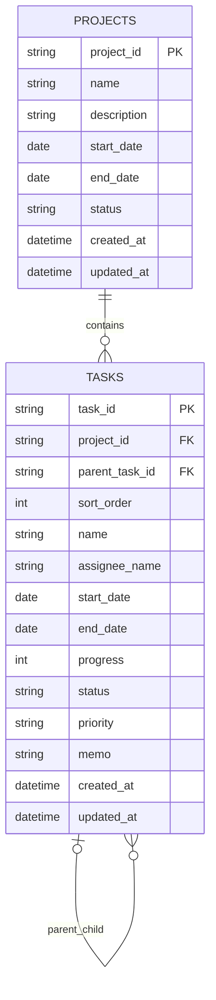

# WBSアプリ DB設計書

## 1. 文書情報

- 対象：初回リリース v0.1（個人利用MVP）
- 改訂日：2026-10-01
- 要件の正本：「02_要件定義_改訂版.md」
- SQLite / EF Core 10系。初回はprojects、tasksとEF管理用テーブルのみ。
- assigneesは後続版。初回Migration・Entity・画面へ追加しない。

## 2. 共通方針

| 項目 | 決定 |
|---|---|
| DB | SQLite |
| 保存先 | %LOCALAPPDATA%/WbsApp/Data/wbsapp.db |
| 主キー | アプリ生成Guid、SQLiteはTEXT |
| 日付 | C# DateOnly、SQLiteはTEXT（日付のみ） |
| 日時 | C# DateTime、UTC、SQLiteはTEXT。読み取り時もUTCとして扱う |
| Enum | C# Enumから明示的な固定文字列へ変換 |
| 削除 | 完全削除。Serviceがトランザクション内で実行 |
| WBS番号・遅延・集計 | 保存せず算出 |
| 初期データ | 配布版は業務データなし |
| スキーマ更新 | EF Core Migration。EnsureCreatedは使わない |

テーブル・列はsnake_case、制約・インデックス名を明示する。文字数はサーバー検証、日付範囲・Enum等はサーバー検証と実際のDB制約の両方で保証する。

## 3. ER図

## 4. projects

| 列 | C# | NULL | 内容 |
|---|---|:---:|---|
| project_id | Guid | 不可 | PK、アプリ生成 |
| name | string | 不可 | 前後空白除去後1～100文字 |
| description | string? | 可 | 最大1000文字 |
| start_date | DateOnly | 不可 | 開始予定日 |
| end_date | DateOnly | 不可 | 終了予定日 |
| status | ProjectStatus | 不可 | IN_PROGRESS / COMPLETED、既定IN_PROGRESS |
| created_at | DateTime | 不可 | UTC |
| updated_at | DateTime | 不可 | UTC、古い編集の検知にも使用 |

- PK：pk_projects。
- CHECK：ck_projects_date_range（end_date >= start_date）、ck_projects_status（定義値のみ）。
- インデックス：ix_projects_status、ix_projects_updated_at（updated_at, project_id）。
- 名前の前方ワイルドカード付き部分一致は通常B-treeでの高速化を期待しない。初回は小規模通常検索とする。
- タスク変更時にもupdated_atを更新する。前値より新しくなるように共通時刻処理で生成する。

## 5. tasks

| 列 | C# | NULL | 内容 |
|---|---|:---:|---|
| task_id | Guid | 不可 | PK、アプリ生成 |
| project_id | Guid | 不可 | 所属プロジェクトFK |
| parent_task_id | Guid? | 可 | 親FK。NULLはルート |
| sort_order | int | 不可 | 同一親配下1から連番 |
| name | string | 不可 | 前後空白除去後1～200文字 |
| assignee_name | string? | 可 | 前後空白除去後最大100文字。空はNULL |
| start_date | DateOnly | 不可 | 開始予定日 |
| end_date | DateOnly | 不可 | 終了予定日 |
| progress | int | 不可 | 0～100、既定0 |
| status | TaskStatus | 不可 | 定義値、既定NOT_STARTED |
| priority | TaskPriority | 不可 | 定義値、既定MEDIUM |
| memo | string? | 可 | 最大2000文字 |
| created_at | DateTime | 不可 | UTC |
| updated_at | DateTime | 不可 | UTC、古い編集検知 |

### 5.1 固定値

| Enum | 値 |
|---|---|
| TaskStatus | NotStarted→NOT_STARTED、InProgress→IN_PROGRESS、InReview→IN_REVIEW、Completed→COMPLETED |
| TaskPriority | High→HIGH、Medium→MEDIUM、Low→LOW |
| ProjectStatus | InProgress→IN_PROGRESS、Completed→COMPLETED |

Enum.ToStringに任せず、固定マッピングを定義する。

### 5.2 外部キーとCHECK

- pk_tasks：task_id。
- fk_tasks_projects：project_id → projects.project_id、ON DELETE CASCADE。
- fk_tasks_parent：parent_task_id → tasks.task_id、ON DELETE RESTRICT。
- ck_tasks_date_range：end_date >= start_date。
- ck_tasks_progress：progress BETWEEN 0 AND 100。
- ck_tasks_status：NOT_STARTED / IN_PROGRESS / IN_REVIEW / COMPLETEDのみ。
- ck_tasks_priority：HIGH / MEDIUM / LOWのみ。
- ck_tasks_sort_order：sort_order >= 1。
- ck_tasks_not_self_parent：parent_task_id IS NULL OR parent_task_id <> task_id。
- ck_tasks_completion：progress = 100とstatus = COMPLETEDが同値。

プロジェクト削除でもServiceが先に子から順に全タスクを削除し、最後にプロジェクトを削除する。CASCADEを深い階層削除の実行方式にしない。親削除はRESTRICTで孤児を防ぐ。

### 5.3 表示順の一意性

NULLを含む単一の複合一意制約だけではルートタスクの重複を防げないため、次の2つを設定する。

| 名称 | 列 | 条件 | 一意 |
|---|---|---|:---:|
| uq_tasks_root_order | project_id, sort_order | parent_task_id IS NULL | ○ |
| uq_tasks_child_order | project_id, parent_task_id, sort_order | parent_task_id IS NOT NULL | ○ |

Fluent APIのHasFilter等でEFモデルへ含め、Migrationとモデルが一致するようにする。条件付きインデックスはData層へ集約する。将来DBでは同じ保証になるようプロバイダー別Migrationを設計する。

追加インデックス：ix_tasks_parent_task_id、ix_tasks_project_end_status（project_id, end_date, status）。既存インデックスの先頭列がカバーする重複インデックスは増やさない。必要性は5,000件の測定で確認する。

### 5.4 アプリ側整合性

- 親の存在、同一プロジェクト、自分・子孫ではないことをServiceで検証する。
- 循環・孤児・兄弟順の非連続を起動時に検出し、自動修復しない。
- WBSはsort_orderをルートから連結する。DBにwbs_number列を設けない。
- 新規は末尾、親変更は移動先末尾、削除後は旧兄弟再採番。
- タスクの担当者名は文字列として独立保存し、担当者マスターFKは設けない。

## 6. 表示順・削除トランザクション

### 表示順更新

単純交換では一時的な一意違反が起きるため、未使用の正整数へ退避してSaveChangesし、その後最終順を設定する。影響する旧親・新親双方の一時番号を確保する。負数・0はCHECKに違反するため使わない。各保存は同一トランザクション内。失敗時は全体をロールバックする。

### 削除

子孫を反復探索で取得して深さの降順で削除する。複数段の削除を一度のSaveChangesへ任せて実行順を推測しない。子がDBから削除済みになった後に親を削除する。対象削除・兄弟再採番・プロジェクトupdated_at更新は同一トランザクション。

### 対象操作

プロジェクト/タスク登録・編集、階層変更、上下移動、関連削除、Project.UpdatedAt更新は必要なデータをまとめて一括処理する。書き込み直列化と古い編集の検証はトランザクションの外側・内側の責務を基本設計に従って実装する。

## 7. 接続・Migration・バックアップ

- 保存先は環境変数を展開した絶対パスへ変換する。接続文字列はSqliteConnectionStringBuilderで構成し、外部キーを有効化する。
- 配布標準はLOCALAPPDATA。ネットワーク共有保存をサポートしない。
- 初期Migration名はInitialCreateとし、EFが生成する時刻IDをそのまま使う。配布済みMigrationを変更・削除しない。
- EF管理用の__EFMigrationsHistoryを使用する。EFが必要に応じて作成する__EFMigrationsLockも管理用テーブルとして扱う。
- 未適用Migrationのある既存DBは、バックアップAPIで取得・検証した後に更新する。
- SQLiteのテーブル再構築を含む更新は既存データで検証する。Migration全体が単一の手動トランザクションに入ると決めつけず、EFの適用方式に従う。
- 不明な適用済みMigrationや新しいスキーマを検出した場合、旧アプリによる起動を止める。
- Migration失敗・ロック残留では通常起動を止め、保守手順と更新前バックアップを案内する。
- バックアップの検証ではSQLiteの整合性・外部キー、必要テーブル、履歴を確認する。成功した自動分のみ10世代保持する。
- 復元時はアプリを停止し、現DBとWAL/SHM等の関連ファイルを退避する。復元ファイルに古い関連ファイルを混在させない。

## 8. 排他と検索

- 初回は単一プロセス・単一利用者。書き込みは共通のプロセス内ロックで直列化する。
- UpdatedAtを使った古いフォームの検出を直列化ロック内で行う。SQLiteロック例外は利用者へ保存失敗を案内し、入力を保持する。
- プロジェクトはDB検索とSkip/Takeで100件/ページ。タスクは選択プロジェクトの必要列をAsNoTrackingで取得し、全体番号・末端集合・検索祖先を組み立てる。
- 日付比較はDateOnly。日時保存はUTC、画面表示はローカルに変換する。

## 9. テストと将来拡張

実SQLiteで一意性、外部キー、CHECK、交換・再採番、親変更、1,100段削除、ロールバック、既存DB更新、バックアップ・復元を確認する。EF InMemoryのみでDB制約の検証を済ませない。

通常1,000タスク、性能検証5,000タスク。後続版の担当者候補はassigneesで独立管理し、名称変更・削除は既存タスクへ反映しない。PostgreSQL移行は別Migrationと明示的データ移行・整合性検証を必要とする。設定変更だけで既存SQLiteデータが移るとは扱わない。

## 10. 技術仕様の確認先

- SQLite一意インデックス：https://www.sqlite.org/lang_createindex.html
- 条件付きインデックス：https://www.sqlite.org/partialindex.html
- 外部キーと再帰深度：https://www.sqlite.org/foreignkeys.html
- SQLiteバックアップ：https://learn.microsoft.com/dotnet/standard/data/sqlite/backup
- EF Core SQLite制限：https://learn.microsoft.com/ef/core/providers/sqlite/limitations
