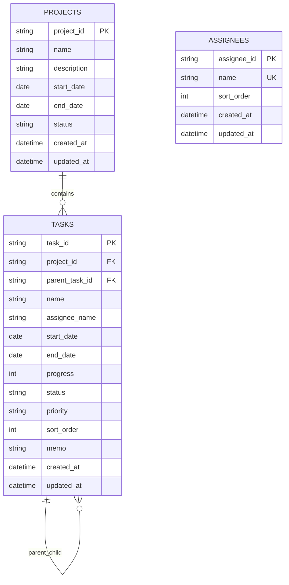

# WBSアプリ DB設計書

## 1. 文書情報

| 項目 | 内容 |
|---|---|
| 文書名 | WBSアプリ DB設計書 |
| 対象システム | WBSアプリ |
| 対象版 | 初回リリース |
| 初回実装DB | SQLite |
| 将来移行先 | PostgreSQL |
| ORM | Entity Framework Core |
| 作成目的 | WBSアプリで使用するデータ構造、制約、関連、削除規則、インデックスおよびMigration方針を定義する |

---

## 2. 設計方針

### 2.1 基本方針

- 初回リリースではSQLiteを使用する。
- 将来の複数人利用時にはPostgreSQLへ移行できる構成とする。
- DB固有のSQLおよび型への依存を最小限にする。
- データアクセスは原則としてEntity Framework Coreを使用する。
- 日時はアプリケーション側でUTCとして保存し、画面表示時に利用環境の時刻へ変換する。
- 主キーはアプリケーション側で生成するUUIDを使用する。
- データ削除は要件どおり完全削除とする。
- WBS番号はDBへ固定保存せず、親子関係と表示順から画面表示時に算出する。
- 進捗率、ステータスおよび優先度はアプリケーションで定義した固定値として管理する。

### 2.2 UUID採用理由

- SQLiteとPostgreSQL間で主キーの採番方式を共通化できる。
- 将来的なデータ移行や複数環境でのデータ統合時にID衝突を抑えられる。
- DB側の自動採番機能への依存を減らせる。

初回実装では、C#の`Guid`を使用し、DB上は文字列として保存する。

| DB | 保存形式 |
|---|---|
| SQLite | `TEXT` |
| PostgreSQL | `uuid`への移行を許容するが、初回はEF Coreモデルとの互換性を優先する |

### 2.3 日時型の方針

| 用途 | C#型 | SQLite | PostgreSQL |
|---|---|---|---|
| 日付のみ | `DateOnly`または`DateTime` | `TEXT` | `date` |
| 作成・更新日時 | `DateTime` | `TEXT` | `timestamp with time zone` |

初回実装で`DateOnly`のプロバイダー差異が問題となる場合は、日付部分のみを使用する`DateTime`へ統一する。

---

## 3. DB構成

### 3.1 DBファイル

| 項目 | 内容 |
|---|---|
| ファイル名 | `wbsapp.db` |
| 推奨保存先 | `%LOCALAPPDATA%/WbsApp/Data/wbsapp.db` |
| 作成タイミング | アプリケーション初回起動時 |
| スキーマ管理 | Entity Framework Core Migration |
| 文字コード | UTF-8 |

### 3.2 テーブル一覧

| No. | テーブル物理名 | テーブル論理名 | 概要 |
|---:|---|---|---|
| 1 | `projects` | プロジェクト | プロジェクトの基本情報を保持する |
| 2 | `tasks` | タスク | WBSを構成するタスク情報を保持する |
| 3 | `assignees` | 担当者候補 | タスク入力時に選択できる担当者候補を保持する |
| 4 | `__EFMigrationsHistory` | Migration履歴 | Entity Framework CoreがMigration適用履歴を管理する |

### 3.3 ER図



`assignees`と`tasks`は外部キーで関連付けない。タスクには担当者名そのものを保存し、担当者候補を削除または名称変更しても、既存タスクの担当者表示を維持する。

---

## 4. テーブル定義

## 4.1 projects（プロジェクト）

### 4.1.1 概要

プロジェクトの名称、説明、予定期間および状態を保持する。

### 4.1.2 カラム定義

| No. | 論理名 | 物理名 | C#型 | SQLite型 | NULL | 既定値 | 制約・内容 |
|---:|---|---|---|---|:---:|---|---|
| 1 | プロジェクトID | `project_id` | `Guid` | `TEXT` | 不可 | - | 主キー。アプリケーション側で生成 |
| 2 | プロジェクト名 | `name` | `string` | `TEXT` | 不可 | - | 1～100文字 |
| 3 | 説明 | `description` | `string?` | `TEXT` | 可 | `NULL` | 最大1000文字 |
| 4 | 開始予定日 | `start_date` | `DateOnly` | `TEXT` | 不可 | - | 日付のみ |
| 5 | 終了予定日 | `end_date` | `DateOnly` | `TEXT` | 不可 | - | 開始予定日以降 |
| 6 | 状態 | `status` | `string` | `TEXT` | 不可 | `IN_PROGRESS` | `IN_PROGRESS`または`COMPLETED` |
| 7 | 作成日時 | `created_at` | `DateTime` | `TEXT` | 不可 | - | UTC |
| 8 | 更新日時 | `updated_at` | `DateTime` | `TEXT` | 不可 | - | UTC |

### 4.1.3 キー・制約

| 種別 | 名称 | 対象 | 内容 |
|---|---|---|---|
| 主キー | `pk_projects` | `project_id` | プロジェクトを一意に識別する |
| CHECK相当 | `ck_projects_date_range` | `start_date`, `end_date` | `end_date >= start_date` |
| CHECK相当 | `ck_projects_status` | `status` | `IN_PROGRESS`, `COMPLETED`のみ |

SQLiteとPostgreSQLの互換性を優先し、文字数および列挙値の検証はアプリケーション側でも必ず行う。

### 4.1.4 インデックス

| 名称 | 対象カラム | 一意 | 用途 |
|---|---|:---:|---|
| `ix_projects_name` | `name` | - | プロジェクト名検索 |
| `ix_projects_status` | `status` | - | 状態絞り込み |
| `ix_projects_updated_at` | `updated_at` | - | 更新日時降順表示 |

### 4.1.5 削除規則

プロジェクト削除時は、同一トランザクション内で配下の全タスクを削除する。

外部キーには`ON DELETE CASCADE`を設定する。ただし、画面では削除対象件数を確認した後、Service層から明示的に削除を実行する。

---

## 4.2 tasks（タスク）

### 4.2.1 概要

プロジェクト配下のタスクを保持する。`parent_task_id`による自己参照で階層構造を表現する。

### 4.2.2 カラム定義

| No. | 論理名 | 物理名 | C#型 | SQLite型 | NULL | 既定値 | 制約・内容 |
|---:|---|---|---|---|:---:|---|---|
| 1 | タスクID | `task_id` | `Guid` | `TEXT` | 不可 | - | 主キー。アプリケーション側で生成 |
| 2 | プロジェクトID | `project_id` | `Guid` | `TEXT` | 不可 | - | `projects.project_id`への外部キー |
| 3 | 親タスクID | `parent_task_id` | `Guid?` | `TEXT` | 可 | `NULL` | ルートタスクの場合は`NULL`。`tasks.task_id`への自己参照 |
| 4 | タスク名 | `name` | `string` | `TEXT` | 不可 | - | 1～200文字 |
| 5 | 担当者名 | `assignee_name` | `string?` | `TEXT` | 可 | `NULL` | 自由入力または候補選択。最大100文字 |
| 6 | 開始予定日 | `start_date` | `DateOnly` | `TEXT` | 不可 | - | 日付のみ |
| 7 | 終了予定日 | `end_date` | `DateOnly` | `TEXT` | 不可 | - | 開始予定日以降 |
| 8 | 進捗率 | `progress` | `int` | `INTEGER` | 不可 | `0` | 0～100の整数 |
| 9 | ステータス | `status` | `string` | `TEXT` | 不可 | `NOT_STARTED` | 固定値 |
| 10 | 優先度 | `priority` | `string` | `TEXT` | 不可 | `MEDIUM` | 固定値 |
| 11 | 表示順 | `sort_order` | `int` | `INTEGER` | 不可 | - | 同一親配下で1から始まる連番 |
| 12 | 備考 | `memo` | `string?` | `TEXT` | 可 | `NULL` | 最大2000文字 |
| 13 | 作成日時 | `created_at` | `DateTime` | `TEXT` | 不可 | - | UTC |
| 14 | 更新日時 | `updated_at` | `DateTime` | `TEXT` | 不可 | - | UTC |

### 4.2.3 キー・制約

| 種別 | 名称 | 対象 | 内容 |
|---|---|---|---|
| 主キー | `pk_tasks` | `task_id` | タスクを一意に識別する |
| 外部キー | `fk_tasks_projects` | `project_id` | `projects.project_id`を参照。削除時CASCADE |
| 外部キー | `fk_tasks_parent` | `parent_task_id` | `tasks.task_id`を参照。物理削除時CASCADE |
| 一意制約 | `uq_tasks_sibling_order` | `project_id`, `parent_task_id`, `sort_order` | 同一階層内の表示順重複を防止する |
| CHECK相当 | `ck_tasks_date_range` | `start_date`, `end_date` | `end_date >= start_date` |
| CHECK相当 | `ck_tasks_progress` | `progress` | 0～100 |
| CHECK相当 | `ck_tasks_status` | `status` | 定義済みステータスのみ |
| CHECK相当 | `ck_tasks_priority` | `priority` | 定義済み優先度のみ |
| CHECK相当 | `ck_tasks_sort_order` | `sort_order` | 1以上 |

### 4.2.4 ステータス値

| 画面表示 | DB値 |
|---|---|
| 未着手 | `NOT_STARTED` |
| 作業中 | `IN_PROGRESS` |
| レビュー中 | `IN_REVIEW` |
| 完了 | `COMPLETED` |

### 4.2.5 優先度値

| 画面表示 | DB値 |
|---|---|
| 高 | `HIGH` |
| 中 | `MEDIUM` |
| 低 | `LOW` |

### 4.2.6 インデックス

| 名称 | 対象カラム | 一意 | 用途 |
|---|---|:---:|---|
| `ix_tasks_project_id` | `project_id` | - | プロジェクト単位の一覧取得 |
| `ix_tasks_parent_task_id` | `parent_task_id` | - | 子タスク取得 |
| `ix_tasks_project_parent_order` | `project_id`, `parent_task_id`, `sort_order` | ○ | WBS順の取得および表示順重複防止 |
| `ix_tasks_name` | `name` | - | タスク名検索 |
| `ix_tasks_assignee_name` | `assignee_name` | - | 担当者検索 |
| `ix_tasks_status` | `status` | - | ステータス絞り込み |
| `ix_tasks_priority` | `priority` | - | 優先度絞り込み |
| `ix_tasks_end_date_status` | `end_date`, `status` | - | 遅延タスク判定 |

SQLiteで部分一致検索を行う場合、通常のB-treeインデックスが前方ワイルドカード付き`LIKE`で使用されないことがある。初回版ではデータ量が小さい前提で通常検索を採用し、必要に応じて将来FTSまたはPostgreSQLの検索機能を検討する。

### 4.2.7 階層整合性ルール

以下はDB制約だけでは完全に保証できないため、Service層で検証する。

- 親タスクと子タスクは同一プロジェクトであること。
- 自分自身を親タスクに指定しないこと。
- 自分の子孫を親タスクに指定しないこと。
- 循環参照を作成しないこと。
- 階層数に固定上限を設けないこと。

### 4.2.8 WBS番号

WBS番号を保存する専用カラムは設けない。

表示時に各階層の`sort_order`をルートから順に連結して算出する。

```text
ルート sort_order = 1          -> 1
子     sort_order = 2          -> 1.2
孫     sort_order = 1          -> 1.2.1
```

この方式により、追加、削除、親変更および並び替え後にWBS番号を個別更新する必要がない。

### 4.2.9 表示順更新

- 新規タスクは同一親配下の末尾へ追加する。
- `sort_order`は同一プロジェクトかつ同一親配下で連続する整数とする。
- 上下移動時は対象タスクと移動先タスクの`sort_order`を交換する。
- 親変更時は移動元の表示順を詰め、移動先の末尾へ追加する。
- 削除後は残った兄弟タスクの`sort_order`を1から再採番する。
- これらの操作はトランザクション内で実行する。

### 4.2.10 進捗・ステータス整合性

Service層で以下を保証する。

- `progress = 100`の場合は`status = COMPLETED`とする。
- `status = COMPLETED`の場合は`progress = 100`とする。
- 完了状態から他の状態へ戻す場合、進捗率は0～99へ変更する必要がある。

### 4.2.11 遅延判定

遅延状態はDBへ保存せず、以下の条件で画面表示時に算出する。

```text
終了予定日 < 現在日
かつ
ステータス != COMPLETED
```

保存値にしないことで、日付経過による状態更新漏れを防ぐ。

---

## 4.3 assignees（担当者候補）

### 4.3.1 概要

タスク登録・編集画面で表示する担当者候補を保持する。

### 4.3.2 カラム定義

| No. | 論理名 | 物理名 | C#型 | SQLite型 | NULL | 既定値 | 制約・内容 |
|---:|---|---|---|---|:---:|---|---|
| 1 | 担当者ID | `assignee_id` | `Guid` | `TEXT` | 不可 | - | 主キー。アプリケーション側で生成 |
| 2 | 担当者名 | `name` | `string` | `TEXT` | 不可 | - | 1～100文字 |
| 3 | 表示順 | `sort_order` | `int` | `INTEGER` | 不可 | - | 一覧および候補の表示順 |
| 4 | 作成日時 | `created_at` | `DateTime` | `TEXT` | 不可 | - | UTC |
| 5 | 更新日時 | `updated_at` | `DateTime` | `TEXT` | 不可 | - | UTC |

### 4.3.3 キー・制約

| 種別 | 名称 | 対象 | 内容 |
|---|---|---|---|
| 主キー | `pk_assignees` | `assignee_id` | 担当者候補を一意に識別する |
| 一意制約 | `uq_assignees_name` | `name` | 同一名称の重複登録を防止する |
| 一意制約 | `uq_assignees_sort_order` | `sort_order` | 表示順重複を防止する |
| CHECK相当 | `ck_assignees_sort_order` | `sort_order` | 1以上 |

### 4.3.4 インデックス

| 名称 | 対象カラム | 一意 | 用途 |
|---|---|:---:|---|
| `ix_assignees_name` | `name` | ○ | 名称重複防止および候補検索 |
| `ix_assignees_sort_order` | `sort_order` | ○ | 表示順取得 |

### 4.3.5 タスクとの関係

- `tasks.assignee_name`に担当者名を直接保存する。
- `tasks`から`assignees`への外部キーは設定しない。
- 担当者候補の削除後も既存タスクの担当者名は維持する。
- 担当者候補の名称変更時も既存タスクの担当者名は自動変更しない。
- 必要であれば将来、一括置換機能を別機能として追加する。

---

## 5. リレーション定義

| 親テーブル | 子テーブル | 関係 | 外部キー | 削除規則 |
|---|---|---|---|---|
| `projects` | `tasks` | 1対多 | `tasks.project_id` | `ON DELETE CASCADE` |
| `tasks` | `tasks` | 1対多の自己参照 | `tasks.parent_task_id` | `ON DELETE CASCADE` |
| `assignees` | `tasks` | 外部キーなし | - | 候補削除後もタスクの担当者名を保持 |

### 5.1 自己参照CASCADEの注意事項

親タスク削除時は子孫タスクも削除する要件であるため、自己参照外部キーにCASCADEを設定する。

ただし、削除前の対象件数確認、エラー表示および監査ログ出力のため、アプリケーション側でも削除対象の子孫を取得してから処理する。

### 5.2 SQLite外部キー設定

SQLiteでは接続ごとに外部キー制約を有効化する必要がある。接続時に以下が有効であることを確認する。

```sql
PRAGMA foreign_keys = ON;
```

Entity Framework CoreのSQLiteプロバイダーおよび接続文字列の設定で外部キーが有効になる構成とする。

---

## 6. 論理削除・履歴管理

### 6.1 削除方針

- 論理削除用の削除フラグは設けない。
- プロジェクト、タスクおよび担当者候補は完全削除する。
- 削除処理前に画面で確認を求める。
- プロジェクトおよび親タスクの削除時は、子孫データも削除されることを表示する。

### 6.2 履歴テーブル

初回リリースでは変更履歴テーブルおよび削除履歴テーブルを設けない。

完全削除後の復元はできないため、配布版ではDBファイルのバックアップ手順をREADMEへ記載する。画面からのバックアップ・復元は将来拡張とする。

---

## 7. トランザクション設計

以下の処理はトランザクション内で実行する。

| No. | 処理 | トランザクション対象 |
|---:|---|---|
| 1 | プロジェクト削除 | プロジェクトおよび配下タスクの削除 |
| 2 | タスク削除 | 対象タスクおよび全子孫タスクの削除、兄弟順の再採番 |
| 3 | タスク並び替え | 移動対象と移動先の表示順更新 |
| 4 | タスク親変更 | 移動元再採番、親ID変更、移動先表示順設定 |
| 5 | 担当者並び替え | 対象担当者候補の表示順更新 |
| 6 | DB初期化 | Migration適用および初期データ投入 |

処理途中で例外が発生した場合は、すべてロールバックする。

---

## 8. 排他制御

### 8.1 初回リリース

初回版は個人利用かつSQLiteのため、複数利用者間の同時更新は対象外とする。

同一アプリ内での重複送信を抑止するため、以下を行う。

- 登録・更新ボタン押下後の二重送信を防止する。
- POST後はPRGパターン（Post/Redirect/Get）を使用する。
- DB書き込み時のSQLiteロック例外を捕捉し、利用者向けメッセージを表示する。

### 8.2 将来の複数人利用

PostgreSQL移行時には、`updated_at`または専用のバージョンカラムによる楽観的排他制御を追加する。

初回版では将来拡張に備え、すべての主要テーブルに`updated_at`を保持する。

---

## 9. 初期データ

### 9.1 必須初期データ

初回リリースでは、業務データの初期登録は必須としない。

ステータスおよび優先度はコードまたは列挙型で定義し、マスターテーブルは作成しない。

### 9.2 任意初期データ

開発環境のみ、動作確認用のプロジェクトおよびタスクをSeedデータとして登録できる。

本番配布時はサンプルデータを登録しない。

---

## 10. Migration設計

### 10.1 基本方針

- EF Core MigrationファイルをGit管理対象とする。
- 本番配布済みMigrationを削除または書き換えない。
- スキーマ変更時は新しいMigrationを追加する。
- 起動時に未適用Migrationを確認し、適用する。
- Migration適用失敗時は通常画面を表示せず、エラー内容と復旧手順を案内する。

### 10.2 Migration命名規則

```text
YYYYMMDDHHmm_変更概要
```

例：

```text
202607231000_InitialCreate
202608051430_AddTaskMemo
```

### 10.3 破壊的変更

以下の変更を行う場合は、事前バックアップを必須とする。

- カラム削除
- テーブル削除
- 型変更
- NULL許可から必須への変更
- 一意制約追加により既存データが違反する可能性がある変更

SQLiteでは一部のALTER TABLE操作が制限されるため、EF Coreが一時テーブルを作成して再構築する場合がある。配布前に既存データを保持したアップデート試験を実施する。

### 10.4 PostgreSQL移行

将来のPostgreSQL移行時は、SQLite用Migrationをそのまま流用せず、以下を実施する。

- PostgreSQL用の初期Migrationを新規作成する。
- UUID、日付、日時および文字列型をPostgreSQL向けに調整する。
- SQLiteデータをエクスポートし、変換後にPostgreSQLへインポートする。
- 件数、親子関係、表示順および制約違反がないことを検証する。

---

## 11. DB初期化・起動処理

### 11.1 初回起動

```text
1. DB保存フォルダーの存在確認
2. フォルダーがなければ作成
3. DB接続確認
4. 未適用Migration確認
5. Migration適用
6. DB整合性確認
7. アプリケーション起動
```

### 11.2 DB保存先作成

保存先が存在しない場合はアプリケーションが自動作成する。

書き込み権限がない場合は、利用者向けに保存先と原因を表示する。

### 11.3 接続文字列例

```json
{
  "ConnectionStrings": {
    "DefaultConnection": "Data Source=%LOCALAPPDATA%/WbsApp/Data/wbsapp.db"
  }
}
```

実装時は環境変数を展開し、OSに適した絶対パスへ変換する。

---

## 12. バックアップ・復元方針

### 12.1 初回リリース

初回版では画面からのバックアップ・復元機能を必須としない。

利用者がアプリを終了した状態で、以下のファイルをコピーすることでバックアップできる。

```text
%LOCALAPPDATA%/WbsApp/Data/wbsapp.db
```

### 12.2 推奨バックアップ

- アプリケーション更新前
- 大量削除前
- 定期的な利用者任意のタイミング

### 12.3 将来拡張

- アプリ画面からのバックアップ作成
- バックアップファイルからの復元
- バックアップ世代管理
- PostgreSQL利用時のサーバーバックアップ

---

## 13. データ検索・取得方針

### 13.1 プロジェクト一覧

| 条件 | 検索方式 |
|---|---|
| プロジェクト名 | 部分一致 |
| 状態 | 完全一致 |
| 既定並び順 | `updated_at`降順 |

### 13.2 WBS一覧

| 条件 | 検索方式 |
|---|---|
| プロジェクトID | 完全一致・必須 |
| タスク名 | 部分一致 |
| 担当者名 | 部分一致 |
| ステータス | 完全一致 |
| 優先度 | 完全一致 |
| 遅延のみ | `end_date < 現在日 AND status <> COMPLETED` |
| 既定並び順 | 階層ごとの`sort_order` |

階層表示は、対象プロジェクトのタスクを取得後、アプリケーション側でツリー構造へ組み立てる方式を初回実装の基本とする。

検索結果に一致した子タスクを表示する場合は、画面上で位置を把握できるよう祖先タスクも表示対象へ含める。

---

## 14. EF Coreエンティティ方針

### 14.1 Project

```text
Project
- ProjectId
- Name
- Description
- StartDate
- EndDate
- Status
- CreatedAt
- UpdatedAt
- Tasks
```

### 14.2 TaskItem

.NET標準の`Task`型との名前衝突を避けるため、C#のエンティティ名は`TaskItem`を推奨する。

```text
TaskItem
- TaskId
- ProjectId
- ParentTaskId
- Name
- AssigneeName
- StartDate
- EndDate
- Progress
- Status
- Priority
- SortOrder
- Memo
- CreatedAt
- UpdatedAt
- Project
- ParentTask
- ChildTasks
```

### 14.3 Assignee

```text
Assignee
- AssigneeId
- Name
- SortOrder
- CreatedAt
- UpdatedAt
```

### 14.4 列挙値

C#では以下のEnumを使用し、DBには固定文字列で保存することを推奨する。

```text
ProjectStatus
- InProgress
- Completed

TaskStatus
- NotStarted
- InProgress
- InReview
- Completed

TaskPriority
- High
- Medium
- Low
```

数値で保存するとEnumの並び変更で意味が変わる可能性があるため、可読性と移行性を優先して文字列保存とする。

---

## 15. 命名規則

### 15.1 DB

- テーブル名：英小文字、複数形、スネークケース
- カラム名：英小文字、スネークケース
- 主キー：`<単数テーブル名>_id`
- 外部キー：参照先主キーと同名
- インデックス：`ix_<テーブル名>_<カラム名>`
- 一意制約：`uq_<テーブル名>_<カラム名>`
- CHECK制約：`ck_<テーブル名>_<内容>`
- 外部キー：`fk_<子テーブル>_<親テーブルまたは用途>`

### 15.2 C#

- クラス名：PascalCase
- プロパティ名：PascalCase
- DB物理名との対応はEF Core Fluent APIで定義する。

---

## 16. セキュリティ・機密情報

- SQLite接続文字列にはパスワードを含めない。
- 将来PostgreSQLを使用する場合、接続情報をソースコードへ直接記述しない。
- 本番用接続情報は環境変数、Secret Managerまたは安全な設定手段で管理する。
- SQLはEF Coreのパラメーター化されたクエリを使用する。
- 生SQLを使用する場合は文字列連結で条件を組み立てない。
- 例外画面に接続文字列、ファイルパスの不要部分、SQL全文等の機密情報を表示しない。

---

## 17. ログ設計

DBにログテーブルは設けず、アプリケーションログへ出力する。

| レベル | DB関連の出力内容 |
|---|---|
| Information | DB初期化開始・完了、Migration適用開始・完了 |
| Warning | SQLiteロック、想定外の再試行、データ不整合検知 |
| Error | DB接続失敗、Migration失敗、トランザクション失敗、制約違反 |

個人情報や入力内容の全文は、原則としてログへ出力しない。

---

## 18. データ量・性能前提

### 18.1 初回想定

| 項目 | 想定件数 |
|---|---:|
| プロジェクト | 100件程度 |
| 1プロジェクト当たりのタスク | 1,000件程度 |
| 担当者候補 | 100件程度 |

### 18.2 性能方針

- 通常の検索、一覧表示、登録、更新および削除は3秒以内を目標とする。
- 一覧取得では不要な関連データを一括ロードしない。
- 読み取り専用検索ではEF Coreの`AsNoTracking`を使用する。
- 大量データで性能問題が発生した場合は、ページングまたは遅延ロードではなく明示的な範囲取得を検討する。
- SQLiteをネットワーク共有フォルダーへ配置して複数端末から同時利用しない。

---

## 19. 整合性チェック

アプリケーション起動時または保守処理で、必要に応じて以下を確認できる構成とする。

- 親が存在しないタスクがないこと。
- 異なるプロジェクトのタスクを親に持つタスクがないこと。
- 循環参照がないこと。
- 同一親配下で`sort_order`が重複していないこと。
- 同一親配下の`sort_order`が連続していること。
- 進捗率が0～100であること。
- 完了タスクの進捗率が100であること。
- 開始予定日が終了予定日を超えていないこと。

---

## 20. 受入条件

### 20.1 DB作成

- 初回起動時に指定保存先へSQLite DBが作成されること。
- 必要なテーブル、外部キー、制約およびインデックスが作成されること。
- 既存DBがある場合、データを削除せず起動できること。

### 20.2 CRUD

- プロジェクト、タスクおよび担当者候補を登録、取得、更新、削除できること。
- プロジェクト削除時に配下タスクが削除されること。
- 親タスク削除時に全子孫タスクが削除されること。
- 担当者候補削除後も既存タスクの担当者名が維持されること。

### 20.3 WBS

- 親子関係を無制限の階層で保存できること。
- 循環参照を登録できないこと。
- 同一階層内で表示順を変更できること。
- 表示順から正しいWBS番号を算出できること。

### 20.4 Migration

- 未適用Migrationを既存データを保持したまま適用できること。
- Migration失敗時に通常処理を継続せず、エラーを確認できること。
- SQLiteの既存DBを使用したアップデート試験が完了していること。

### 20.5 PostgreSQL移行性

- ControllerおよびViewにSQLite固有SQLが存在しないこと。
- Entity Framework CoreのDBプロバイダーを差し替えられる構成であること。
- 主キー、日付、日時、Enumおよび外部キーがPostgreSQLへ変換可能であること。

---

## 21. 実装時の確定事項

| 項目 | 決定内容 |
|---|---|
| 初回DB | SQLite |
| 将来DB | PostgreSQL |
| 主キー | アプリケーション生成UUID |
| WBS番号 | DBへ保存せず動的算出 |
| 階層表現 | `tasks.parent_task_id`による自己参照 |
| 並び順 | `tasks.sort_order` |
| 担当者 | `tasks.assignee_name`へ文字列保存 |
| 担当者候補 | `assignees`で管理し、タスクとは外部キー接続しない |
| 遅延状態 | DBへ保存せず動的判定 |
| 削除 | 完全削除 |
| プロジェクト削除 | 配下タスクをCASCADE削除 |
| タスク削除 | 子孫タスクをCASCADE削除 |
| 日時 | UTC保存 |
| Migration | EF Core Migration |
| DBファイル | `%LOCALAPPDATA%/WbsApp/Data/wbsapp.db` |

---

## 22. 次工程への引継ぎ事項

実装前に以下を作成または確定する。

1. EF CoreエンティティおよびFluent API設定
2. 初期Migration
3. SQLite接続文字列生成処理
4. 起動時Migration適用処理
5. WBSツリー構築処理
6. 循環参照検証処理
7. 表示順の追加・移動・再採番処理
8. 削除対象件数取得および削除トランザクション
9. PostgreSQL差し替えを考慮したDbContext登録方式
10. 既存DBを使用したバージョンアップ試験手順
